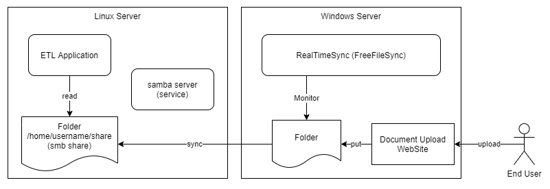

# Sync Files between Windows and Linux

## Background

We're facing one need that the application is running on one Linux (RedHat) server for report analysis, the ETL tool _Kettle_ expect to read source file uploaded to one local folder.

Instead of asking end user to upload file to Linux Server file system, our previous project had already built one Windows based web-tool (called Document Manager) to allow user download and upload files through browser, here we'd like to reuse the existing capability to make one working procedure to have file auto-sync to Linux Server.

## Solution Illustration



Key elements to be considered:

- Windows Server opens HTTPS to end user's network, allowing user accessing the web page and authenticate via SSO
- Install "FreeFileSync" on Windows Server
- Install samba server on Linux server, enable smbd service deamon on
- Base on ETL Application need, create destination folder in Linux server and configure samba share
- Test connection from Windows Server to Linux Server's file sync function via FreeFileSync (manually)
- Create real time monitor in Windows Server via ReamTimeSync setting

## Preparation

### Install FreeFileSync on Windows Server

Come to website: https://freefilesync.org/


Choose Download, then select the Windows version:


After installing, you should see below window when run the freefilesync application:


Note there are four options to the destination side:


In our scenario, we can choose "Mirror" instead of default "Two way".

### Install samba server on Linux Server (using Ubuntu as example)

A Samba file server enables file sharing across different operating systems over a network.

My environment is Ubuntu 20.04.1 LTS, the command can be different to the RedHat server, but the theory is similar.

To install Samba, we can run:

```
sudo apt update
sudo apt install samba
```

Check Samba version:

```
samba --version
```

My result is "Version 4.11.6-Ubuntu"

Check if the installation was successful by running:

```
whereis samba
```

If you get following output, then it's OK:

```
samba: /usr/sbin/samba /usr/lib/x86_64-linux-gnu/samba /etc/samba /usr/share/samba /usr/share/man/man7/samba.7.gz /usr/share/man/man8/samba.8.gz
```


## Synchronization Configuration

